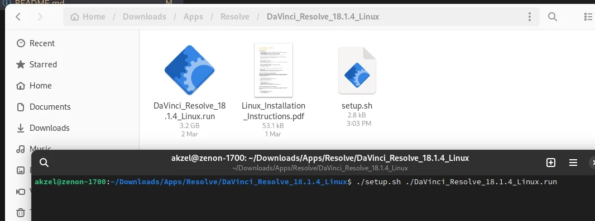

# davincibox

This project aims to provide a ready-to-go container with all of the needed dependencies to install and run DaVinci Resolve on Linux, based on information compiled by bluesabre in his [GitHub Gist](https://gist.github.com/bluesabre/8814afece711b0ca49de34c41e50b296). This is primarily intended for users of image-based systems such as Fedora Silverblue, but can be used on any Linux distro that distrobox is available on.

## Disclaimer

I've only been able to test this setup with an AMD RX 6600XT GPU. NVIDIA cards, Intel cards, and other generations of AMD cards are completely untested. See [#21](https://github.com/zelikos/davincibox/issues/21)

## Requirements

You will need `distrobox` or `toolbox`. Distrobox is highly recommended for ease of use.

If using an Nvidia GPU, you will also need the `nvidia-container-runtime` package installed to your system.

You will also need the latest release of DaVinci Resolve from [Blackmagic's website](https://www.blackmagicdesign.com/products/davinciresolve)

If you're less comfortable in the CLI, I recommend using the `setup.sh` script from this repository to help simplify the setup process, but ultimately use of the CLI is currently a requirement.

## Setup

### CLI:

Open a terminal, then run `chmod +x /path/to/setup.sh`

Then, `/path/to/setup.sh /path/to/DaVinci_Resolve_versionnumber_Linux.run`

### GUI:

If you're more comfortable in a GUI:

If you're using GNOME, open Files and navigate to where you downloaded the script to. In the example below, the script is in the same folder that I extracted the DaVinci Resolve download to. I recommend you do the same for ease of use, as the rest of the instructions will assume you have done so.


Right-click, and select Properties.


Then, make sure "Executable as Program" is toggled on.


Right-click on an empty spot in the folder. You should see either "Open in Console" as in the screenshot, or "Open in Terminal." Either will be fine.


In the newly-opened terminal window, enter the command below. Replace 'version' with the version of DaVinci Resolve that you are installing (see screenshot for example):

```
./setup.sh ./DaVinci_Resolve_version_Linux.run
```



Then, follow any further prompts in the installation script.

### Manual

First, get davincibox set up.

Distrobox:

```
distrobox create -i ghcr.io/zelikos/davincibox:latest -n davincibox
distrobox enter davincibox
```

Toolbox:

```
toolbox create -i ghcr.io/zelikos/davincibox:latest -c davincibox
toolbox enter davincibox
```

Then, run `setup-davinci /path/to/DaVinci_Resolve_version_Linux.run distrobox/toolbox` from within the container

e.g.

Distrobox:

```
distrobox enter davincibox -- setup-davinci /path/to/DaVinci_Resolve_version_Linux.run distrobox
```

Toolbox:

```
toolbox run --container davincibox setup-davinci /path/to/DaVinci_Resolve_version_Linux.run toolbox
```

The suffix at the end is for the `add-davinci-launcher` script. If omitted, setup will still run, but adding the launcher to your application menu won't work.

You can still run `add-davinci-launcher` separately, as either `add-davinci-launcher distrobox` or `add-davinci-launcher toolbox`, depending on what you're using.

## Uninstallation

Run `./setup.sh remove`, or

Distrobox:

```
distrobox enter davincibox -- add-davinci-launcher remove
distrobox stop davincibox
distrobox rm davincibox
```

Toolbox:

```
toolbox run --container davincibox add-davinci-launcher remove
podman container stop davincibox
toolbox rm davincibox
```

## Credits

Sean Davis, AKA [bluesabre](https://github.com/bluesabre)
- For putting together [this Gist](https://gist.github.com/bluesabre/8814afece711b0ca49de34c41e50b296); davincibox's Containerfile and setup scripts are heavily based on that information

[Jorge Castro](https://github.com/castrojo) and [Universal Blue](https://github.com/ublue-os)
- Jorge's blog post about [declaring distroboxes](https://www.ypsidanger.com/declaring-your-own-personal-distroboxes/) planted the seed for davincibox to become a thing
- Pretty much everything on the GitHub CI part of this is based on [uBlue's Boxkit](https://github.com/ublue-os/boxkit)